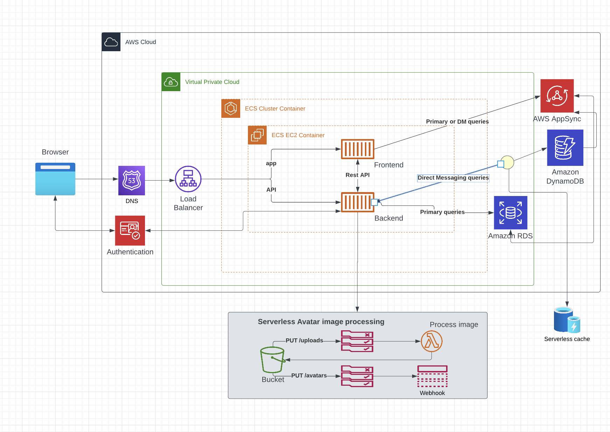
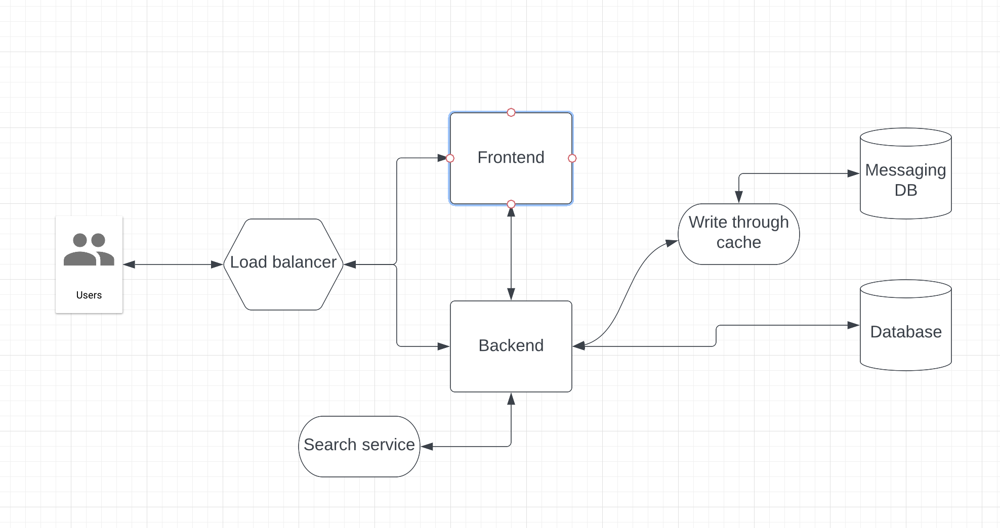
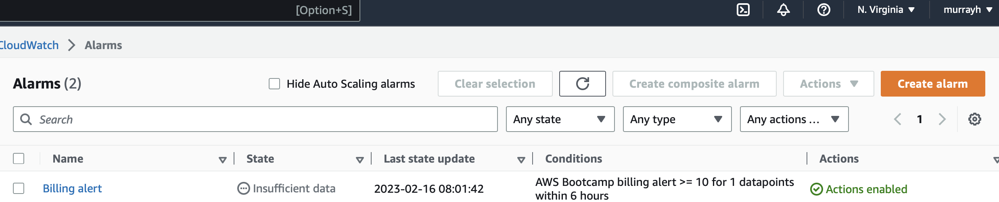
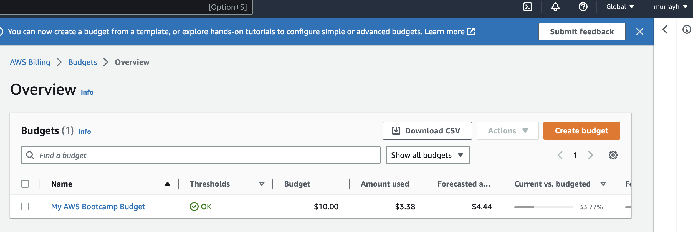

# Week 0 — Billing and Architecture

## Recreate Logical Architectual Diagram in Lucid Charts

[Link to Lucid charts diagram](https://lucid.app/lucidchart/9d710cc6-212e-4621-b4f0-bc5e0a570b4a/edit?viewport_loc=226%2C121%2C1751%2C948%2C0_0&invitationId=inv_faffea5c-fde7-48f3-b6e9-d3b5867a2fb4)

## Napkin diagram 

[Link to lucid charts napkin diagram](https://lucid.app/lucidchart/01cee847-cc37-40b9-8758-562728041a33/edit?viewport_loc=-11%2C-5%2C1589%2C860%2C0_0&invitationId=inv_7d3cefa4-50f2-408f-ae32-0fe9bcbfb8e4)

## Installed AWS CLI

See gitpod.yml in this repo

## Create a Billing Alarm

## Create a Budget

