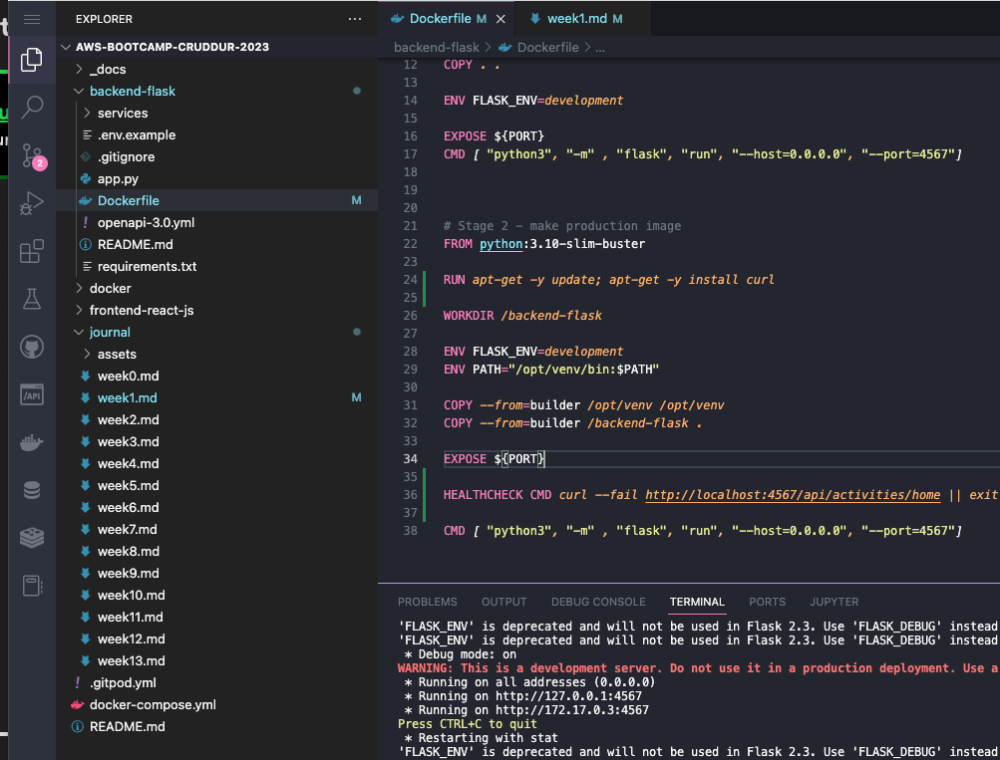
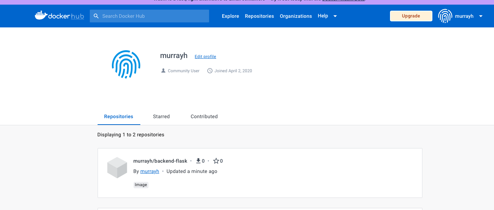
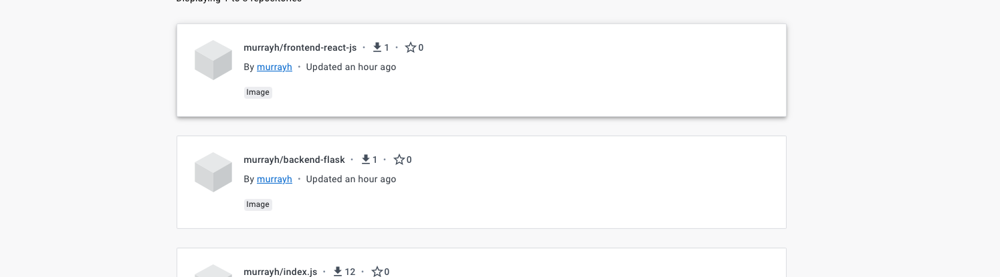
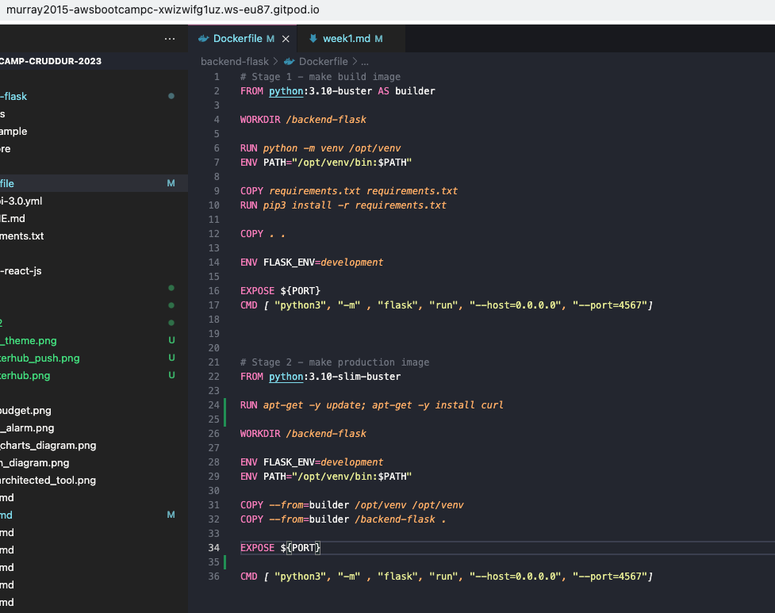
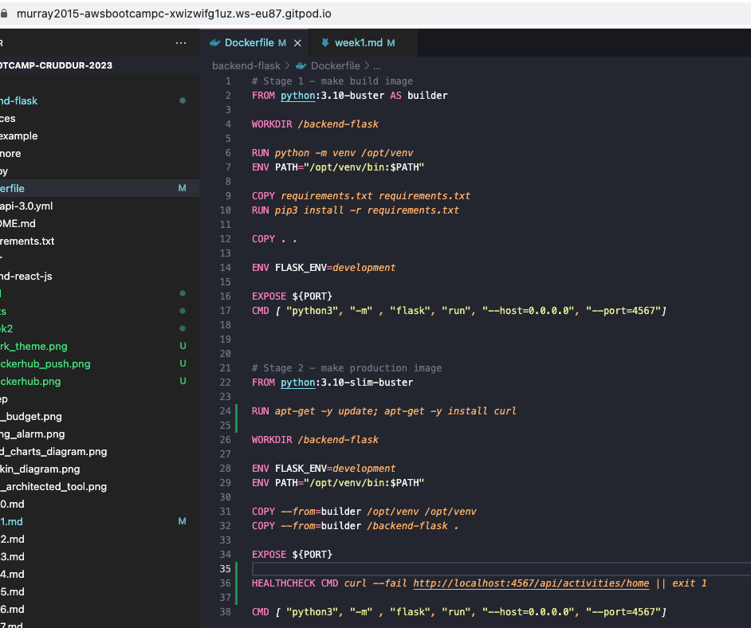

# Week 1 — App Containerization

## Worked out how to do dark themes in gitpod 

## Signed up for dockerhub 

## pushed images to docker hub 

## Made multistage build dockerfile. Struggled slightly with how to deal with installing libs once only. Worked it out (used a venv inside, and copied it across. Much faster build.)

## Added a healthcheck, got confused as curl wasn't installed. Installed Curl. Learned how to check the health check with the inspect command. 

