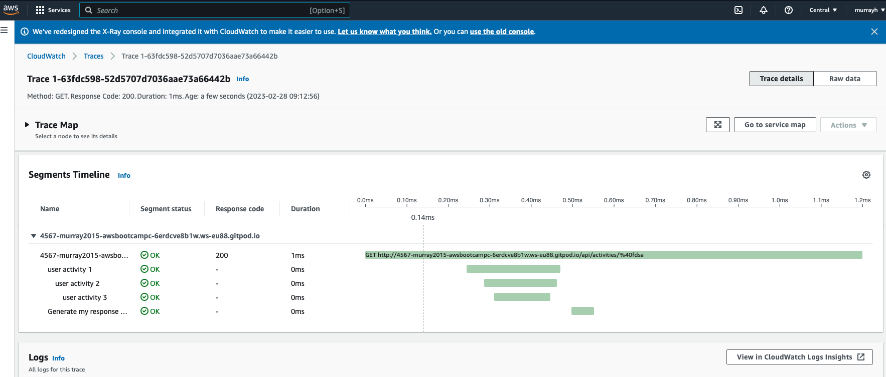
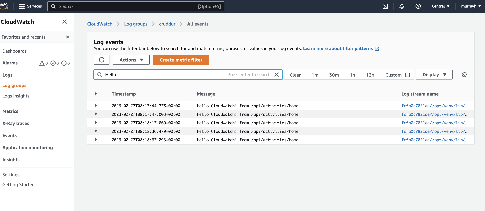

# Week 2 — Distributed Tracing

## Open Telemetry (OTEL) with Honeycomb.io 
Sending data to honeycomb: 

Sending data attributes: 

Sending extra spans: 

## AWS X-Ray 

## Rollbar 

## WatchTower - CloudWatch Log 

## Homework and stretch goals 

### Added extra attributes, plus spans and subspans to xray (worked out independently of Andrew's follow up video, which has stolen my thunder a bit)

### Made and saved dashboards and extra queries in honeycomb 

