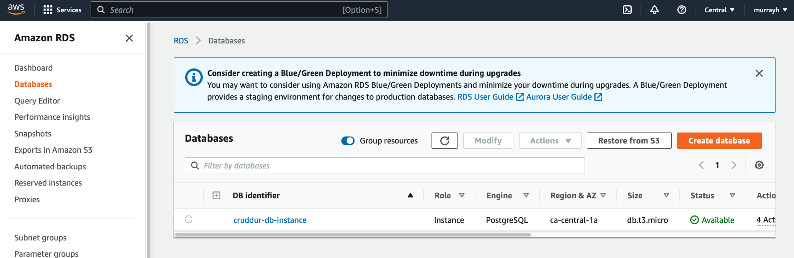
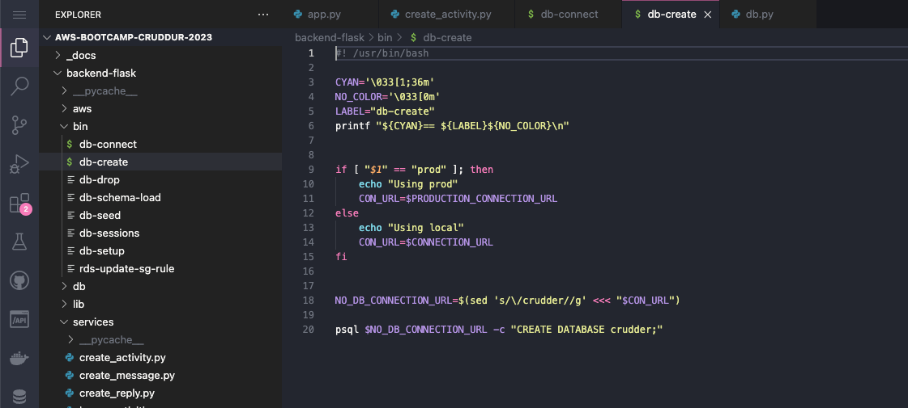
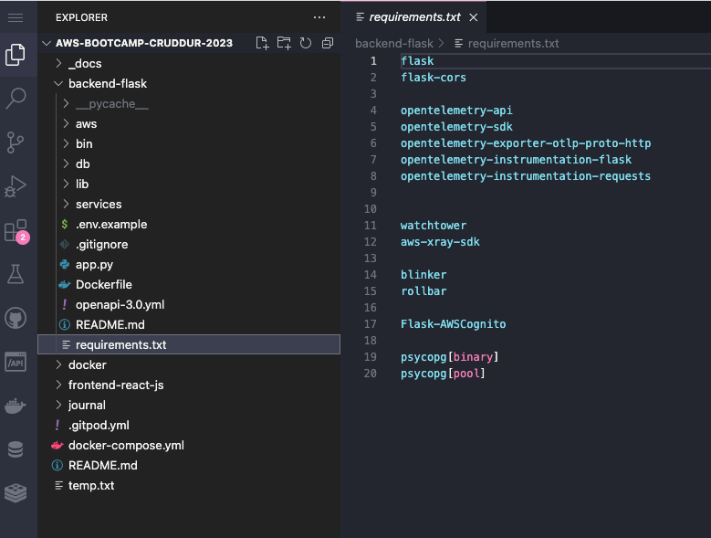
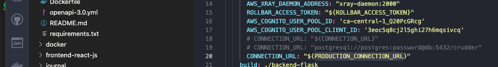
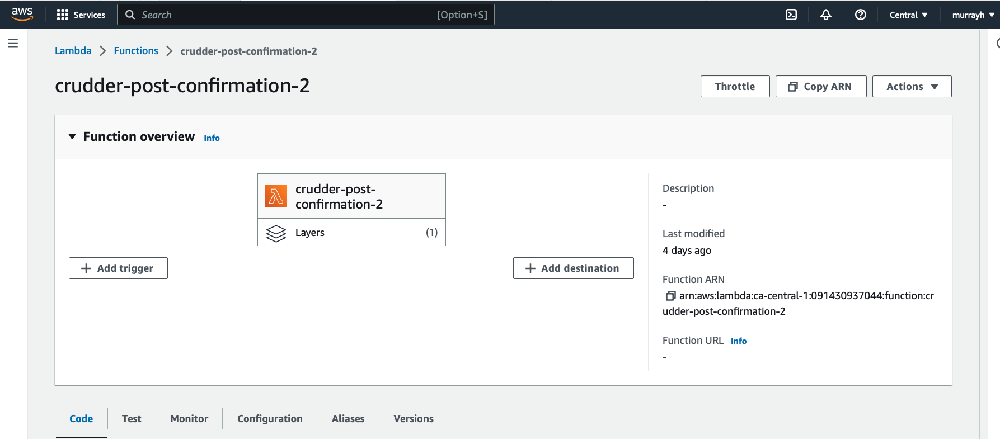
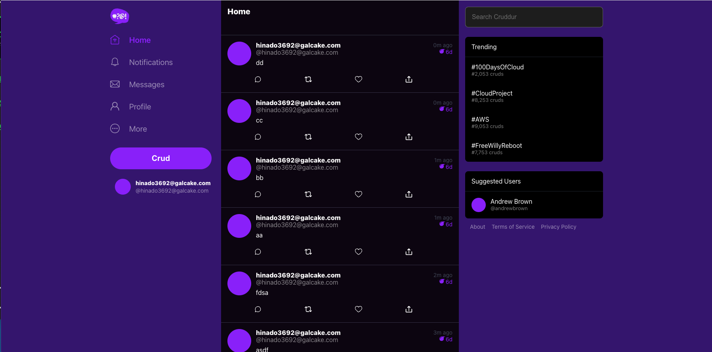
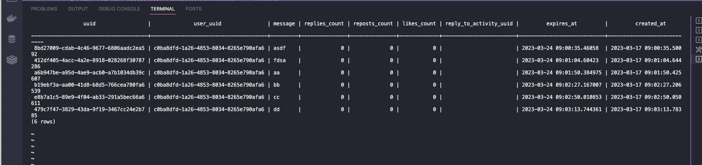

# Week 4 — Postgres and RDS

### Made and connected RDS 

## Added bash scripts 

## Added the DB driver

## Connected to the DB

## Added lambdas

I used 2 lambdas in the end too (like Andrew's video) because Lambda started supporting python 3.9 after Andrew's video came out, and the postgres lambda layer only suports 3.8, which led to some experimentation to bug fix...! 

## Creating activities

Note there's a bug in Andrew's implementation, as he has hard coded his user handle as "andrewbrown" in the start of all the backend functions. This happens to work on his videos, as the user name he's entering to cognito also has the handle "andrewbrown", but for anyone else it won't work due to the join on user handle! I fixed by passing the user through as props in the Front end and then sending in the form's json data. 

